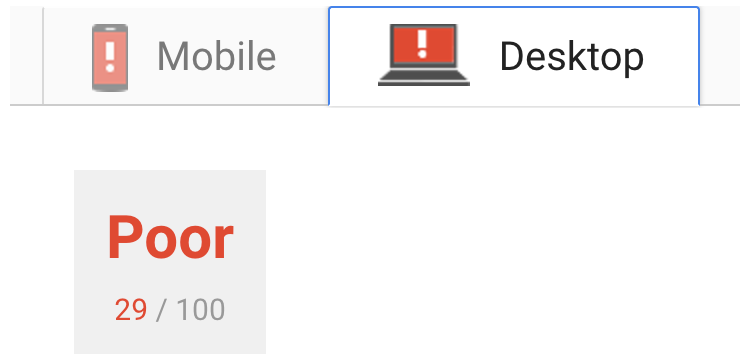
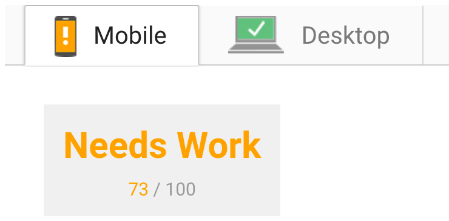
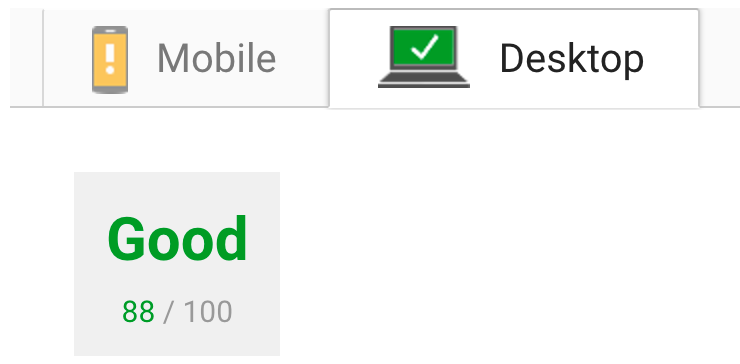

# Website Optimization Project

This repository takes the [mobile portfolio website](https://github.com/udacity/frontend-nanodegree-mobile-portfolio)
supplied by Udacity as its starting point and optimises the site with two aims:

1. Optimize PageSpeed Insights score for index.html to achieve a score of at
least 90 for mobile and desktop.

1. Optimize Frames per Second in pizza.html to render with a consistent 60fps
frame-rate.

I've optimized this site as part of the [Front-End Web Developer Nanodegree](https://www.udacity.com/course/front-end-web-developer-nanodegree--nd001).

## Running the Application

You have two options for viewing and testing the site:

1. You can [visit the deployed site on GitHub Pages.](https://tobiasziegler.github.io/fend-p6-website-optimization/)

1. For testing and development on a local server:

	1. Clone or download the `master` branch.

	1. Run `npm install` to install dev dependencies.

	1. Use `gulp serve` to open the site in your browser. Note that you'll be
	shown an `ngrok` URL in the terminal that can be used for access from other
	devices or for testing with PageSpeed Insights.

	1. After changing any of the source files, run `gulp build` to update the
	site.

## Baseline Performance Testing

Initial PageSpeed Insights scores - tested on GitHub Pages:

Initial PageSpeed Insights scores - tested on local Browsersync server (URL via ngrok):

## Optimizations Made

### Part 1: Optimize PageSpeed Insights score for index.html

- Automatically optimize images using `gulp-imagemin`.
- Add media type to the print stylesheet link to prevent render blocking.
- Load the Google Analytics script asynchronously.
- Use Web Font Loader for loading Google Fonts to prevent render blocking.
- Inline the main stylesheet using `gulp-inline-source`.
- Minify the HTML files using `gulp-htmlmin`.
- Minify the JavaScript files using `gulp-uglify`.
- Minify the CSS files using `gulp-cssnano`.

### Part 2: Optimize Frames per Second in pizza.html
